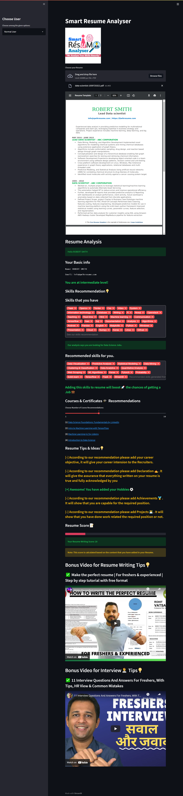
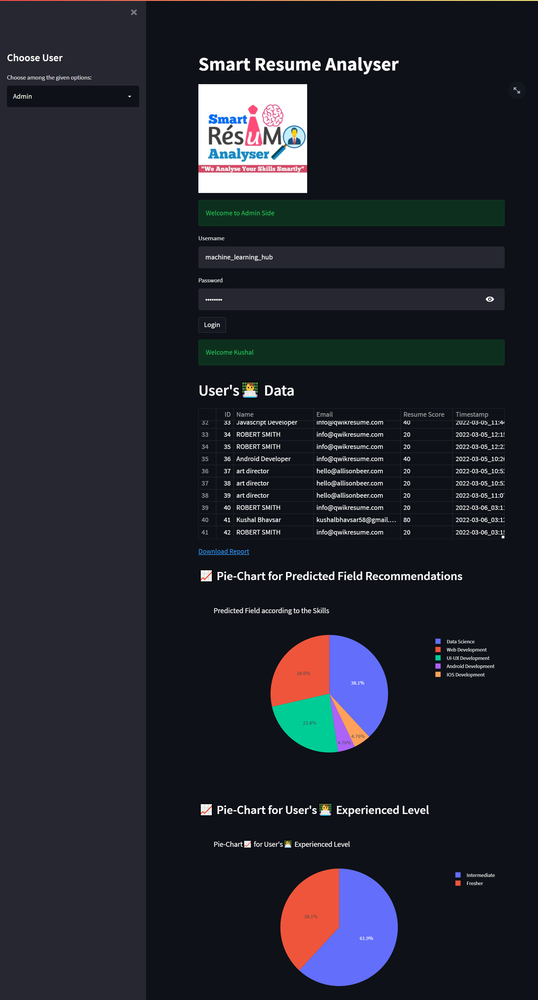

# 📄 Smart Resume Analyser

[](https://www.python.org/)                 
[](https://www.python.org/downloads/release/python-360/) 

A web application that parses uploaded resumes and provides smart, personalized recommendations — including career field detection, skill gap analysis, course suggestions, and a resume score.

Built with **Python** and **Streamlit**, with a **MySQL** backend for storing user analytics.

---

## 🚀 Features

- **Resume Parsing** — Extracts name, email, skills, and experience from PDF resumes
- **Career Field Detection** — Identifies whether the candidate is suited for Data Science, Web Development, Android, iOS, or UI/UX
- **Skills Recommendations** — Suggests relevant skills based on detected field
- **Course & Certificate Suggestions** — Recommends online courses to fill skill gaps
- **Resume Score** — Scores the resume based on key content sections
- **YouTube Video Recommendations** — Suggests relevant tutorial videos
- **Admin Dashboard** — View all user data, pie charts of field distribution, and export reports as CSV
- **User & Admin Modes** — Separate interfaces for candidates and administrators

---

## 🛠️ Tech Stack

| Layer | Technology |
|---|---|
| Frontend / UI | Streamlit |
| Resume Parsing | PyResparser, PDFMiner3 |
| Data Handling | Pandas |
| Visualization | Plotly |
| Database | MySQL (via PyMySQL) |
| Language | Python 3.x |

---

## ⚙️ Setup & Installation

### 1. Clone the repository
```bash
git clone https://github.com/faaizhamid07/smart-resume-analyser.git
cd smart-resume-analyser
```

### 2. Install dependencies
```bash
pip install -r requirements.txt
```

### 3. Set up the database
- Install [XAMPP](https://www.apachefriends.org/) or any MySQL-compatible control panel
- Start **Apache** and **MySQL** services
- The app will auto-create the required database and tables on first run

### 4. Run the app
```bash
streamlit run App.py
```

---

## 📁 Project Structure

```
smart-resume-analyser/
│
├── App.py                  # Main Streamlit application
├── Courses.py              # Course and YouTube video recommendation data
├── requirements.txt        # Python dependencies
├── Logo/                   # App logo assets
└── Uploaded_Resumes/       # Folder where user-uploaded resumes are saved
```

---

## 🖼️ Screenshots

### User Side


### Admin Side


---

## 🔐 Admin Credentials (Demo)

| Field | Value |
|---|---|
| Username | `machine_learning_hub` |
| Password | `mlhub123` |

> ⚠️ Change these credentials before deploying to production.

---

## 📦 Requirements

```
pdfminer3
pyresparser
streamlit
pandas
pafy
plotly
pymysql
streamlit-tags
Pillow
```

---

## 🙋 Author

**Faaiz Hamid**  
M.Tech — Information Technology, USICT, GGSIPU  
[GitHub](https://github.com/faaizhamid07)

## Follow me and give a star⭐ on my repository
## [Donate me on PayPal(It will inspire me to do more projects)](https://www.paypal.me/satiress)
